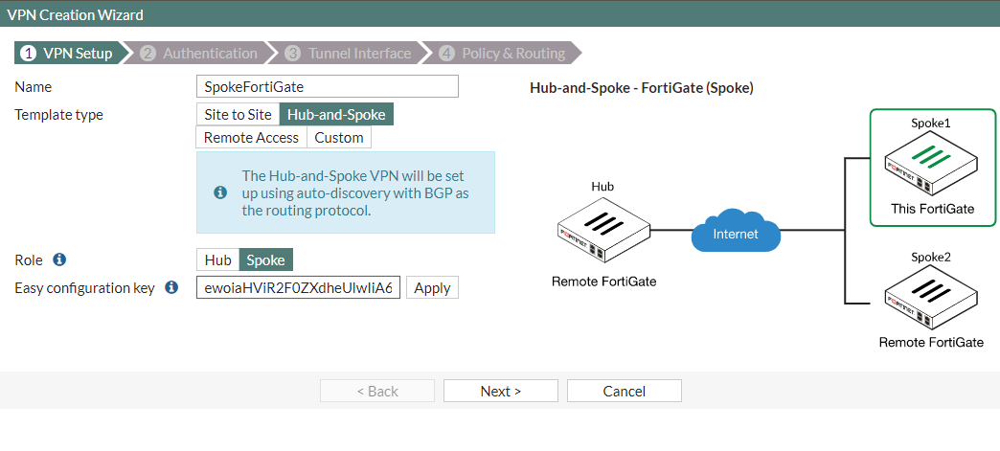
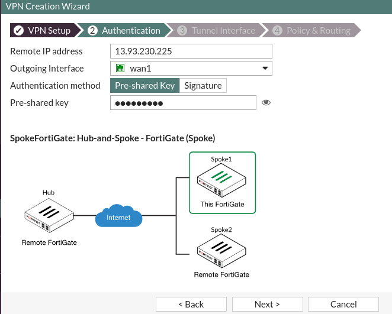
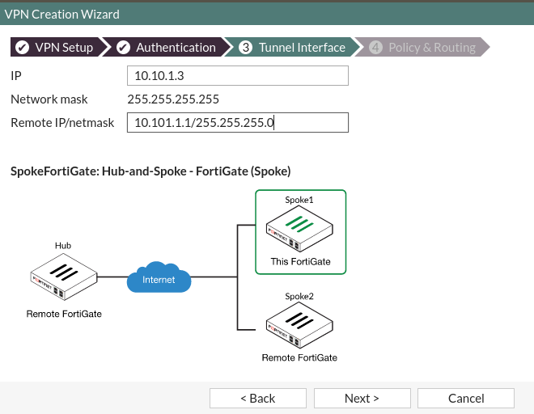
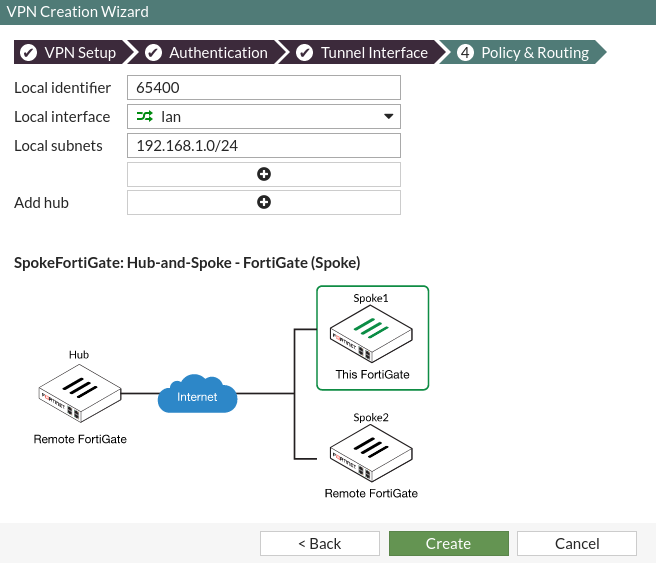
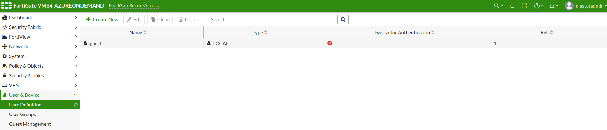
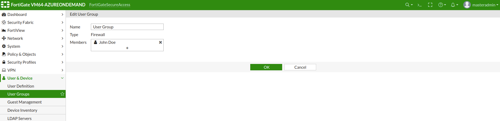
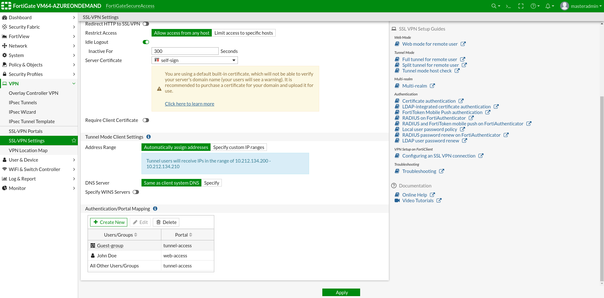
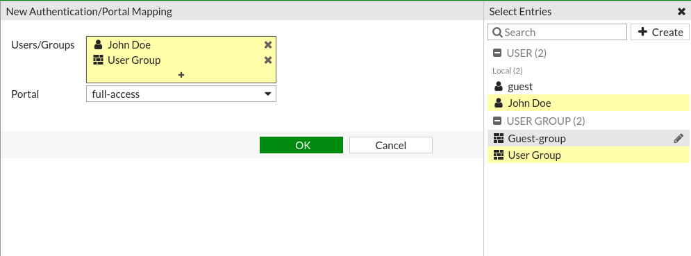
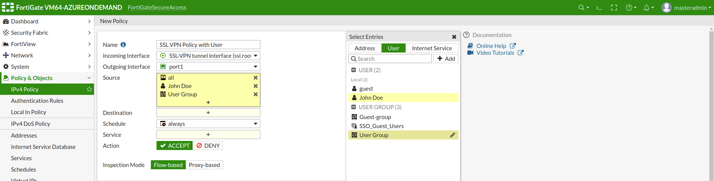

FortiGate secure remote access with Terraform beta release.

# Deployment

> This script requires the [Azure CLI](https://docs.microsoft.com/en-us/cli/azure/install-azure-cli?view=azure-cli-latest).

1. Login to Azure with `az login`. 
2. Add your Client ID, Subscription ID and Tenant ID to the Terraform vars.tf. 
3. Adjust the `remote_subnet` and `remote_subnet_netmask` variables to that of your spoke FortiGate subnet range. The default value is `10.100.81.0`.
4. Run `terraform init`. 
5. Run `terraform apply`. 

To navigate to your deployed FortiGate use the Public IP address and the default admin port of 8443.

The default admin username and password can be found in vars.tf under `admin_name` and `admin_password`.  

> **Note:** For ease of configuration, search for **EasyKey** in the output. It will contain configuration that can be applied to Spoke VPN devices.

# Spoke FortiGate Setup
  
Once the Terraform deployment is complete, follow the steps below to attach the spoke to the FortiGate hub.

1. Navigate to your spoke FortiGate and open **VPN > IPsec Wizard**.
2. Enter a **Name** for the spoke.
3. For **Template type**, select `Hub-and-Spoke`.
4. Under **Role**, ensure `Spoke` is selected.
5. Click **Next** and you will be brought to the Authentication tab.

<i>Note: Enter **EasyKey** from the output will contain configuration that can be applied to Spoke VPN devices for ease of configuration.</i> 

### Authentication

1. Under **Remote IP Address** enter the Public IP address of the FortiGate you deployed. You can find this value in the outputs. Run `terraform output` in the deployment folder to see the results again.

2. The **Outgoing interface** should adjust automatically based on the **Remote IP address** entered.
3. Enter the **Pre-shared key**. This can be found in the `vars.tf` file under `psk_key`.

For <i>EasyKey</i> setup, only the Pre-shared key needs to be entered.

### Tunnel Interface:

1. Select an IP address for the SSL VPN tunnel interface.
2. Input the hub tunnel IP address and netmask.

   

### Policy & Routing

1.  Select the local interface, and input the local subnet.
2.  Click **Create** and the VPN wizard should finalize.

    

### Bring Up Phase Selectors

1. Navigate to **Monitor > IPsec Monitor.**
2. Select the new VPN and bring up the connection.

   

# SSL VPN Users/Groups creation and configuration guide

### Create a new local user
> These steps are performed on the FortiOS GUI.

1. On the navigation bar, select **User & Device > User Definition**.
2. Click **Create New**:

   

3. Select **Local User**.
4. Set up credentials for the user.
5. (Optional) Add an **Email address**.
6. Click **Submit**.

### Create a new User Group
> These steps are performed on the FortiOS GUI.

1. On the navigation bar, select **User & Device > User Groups**.
2. Click **Create New**:

  

3. Under **Type**, select **Firewall**.
4. Enter the name of the group and select members:

    

5. Click **OK**.

### Add a user/user group to Authentication/Portal Mapping
> These steps are performed on the FortiOS GUI.

1. On the navigation bar, select **VPN > SSL-VPN Settings**.
2. At the bottom of **SSL-VPN Settings** page, there is a table to assign **User** and/or **User group** to specific portals to use.

  

3. Click **Create New** :

  

4. Select **User** and/or **User group**.
5. Select **Portal**.
6. Click **OK**.

### Adding a User/User Group to the SSL VPN Policy
> These steps are performed on the FortiOS GUI.

1. On the navigation bar, select **Policy & Objects > IPv4 Policy**.
2. Enter a **Name** for the policy (if not editing).
3. The **Incoming Interface** should be **SSL-VPN tunnel interface (ssl.root)**.
4. Select the desired **Outgoing interface**.
5. Under **Sources**, select addresses and on the **User** tab select the **User** and/or **User group**. 
6. Select a **Destination** and **Service**.
7. Click **OK**.

  

# Support

Fortinet-provided scripts in this and other GitHub projects do not fall under the regular Fortinet technical support scope and are not supported by FortiCare Support Services.
For direct issues, please refer to the [Issues](https://github.com/fortinet/terraform-secure-remote-access-beta/issues) tab of this GitHub project.
For other questions related to this project, contact [github@fortinet.com](mailto:github@fortinet.com).

## License

[License](./LICENSE) © Fortinet Technologies. All rights reserved.
