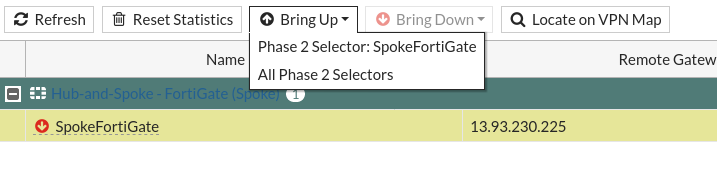

FortiGate Secure Remote access with terraform

# Deployment

> This Script requires the azure cli for information on downloading it see the following link: https://docs.microsoft.com/en-us/cli/azure/install-azure-cli?view=azure-cli-latest

1. login to azure with `az login` 
2. Add your Client ID, Subscription ID and Tenant ID to the terraform vars file 
3. Adjust the `remote_subnet` and `remote_subnet_netmask` vars to your work/home fortigate subnet range. The current default is 10.100.81.0
4. Run `terraform init` 
5. Run `terraform apply` 

To navigate to your deployed FortiGate use the PublicIP and the default admin port is 8443

The default admin and password can be found under vars.tf under `admin_name` and `admin_password`

# Spoke FortiGate Setup

Once the terraform deployment is complete, follow the steps below to attach the spoke to the FortiGate HUB

1. Navigate to your spoke FortiGate and open VPN->IPsec Wizard.
2. Choose a Name for the spoke and choose `Hub-and-Spoke` Template type.
   Under role ensure Spoke is selected. Click next and you will be brought to the authentication tab.

### Authentication:

1. Under Remote IP Address enter the Public IP of the FortiGate you deployed, this should be in the outputs. You can also run `terraform output` in the deployment folder to see the results again.
2. The Outgoing interface should adjust automatically based on the Remote IP address entered.
3. Enter the Pre-shared key. This can be found in the vars.tf file under `psk_key`

   

### Tunnel Interface:

1. Select an IP for the SSL VPN tunnel interface.
2. Input the HUB tunnel IP and netmask

   

### Policy & Routing

1.  Select the local interface, and inpiut the local subnet.
2.  Click create and the VPN wizard should finalize.

    

### Bring UP phase selectors

1. Navigate to Monitor -> IPsec Monitor
2. Select the new VPN and bring up the connection

   

# Support

Fortinet-provided scripts in this and other GitHub projects do not fall under the regular Fortinet technical support scope and are not supported by FortiCare Support Services.
For direct issues, please refer to the [Issues](https://github.com/fortinet/load-balancer-rule-sync/issues) tab of this GitHub project.
For other questions related to this project, contact [github@fortinet.com](mailto:github@fortinet.com).

## License

[License](./LICENSE) © Fortinet Technologies. All rights reserved.
